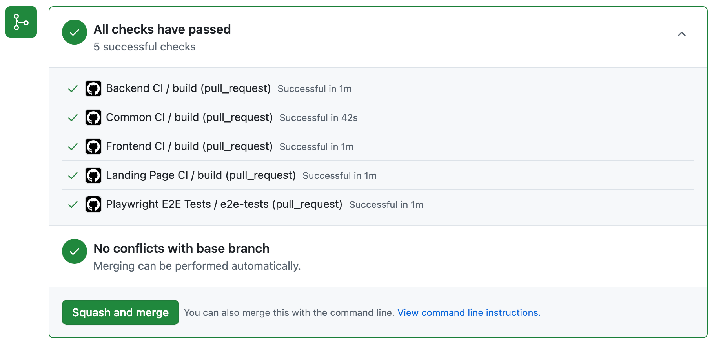
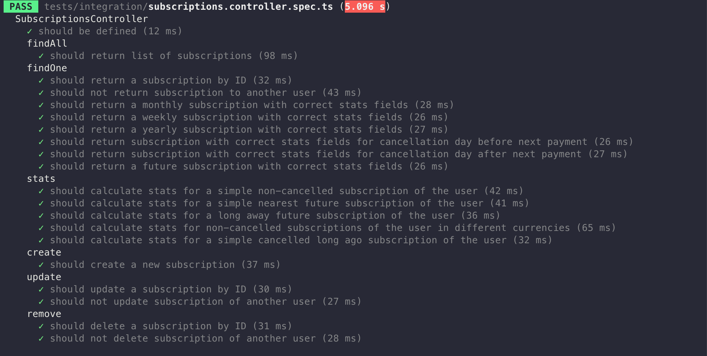
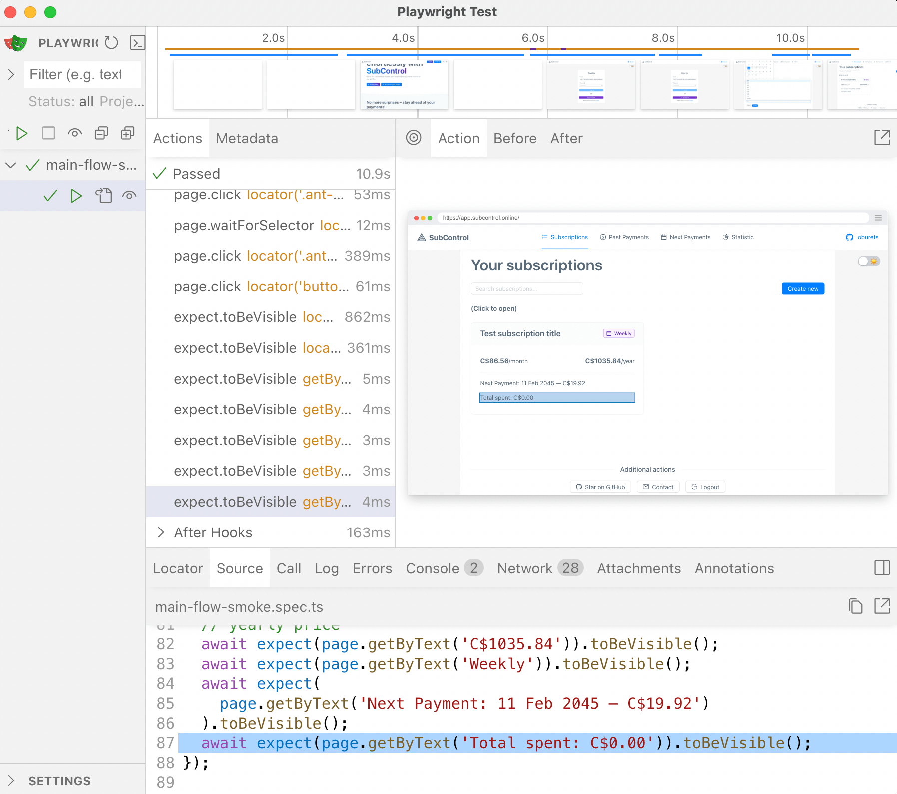
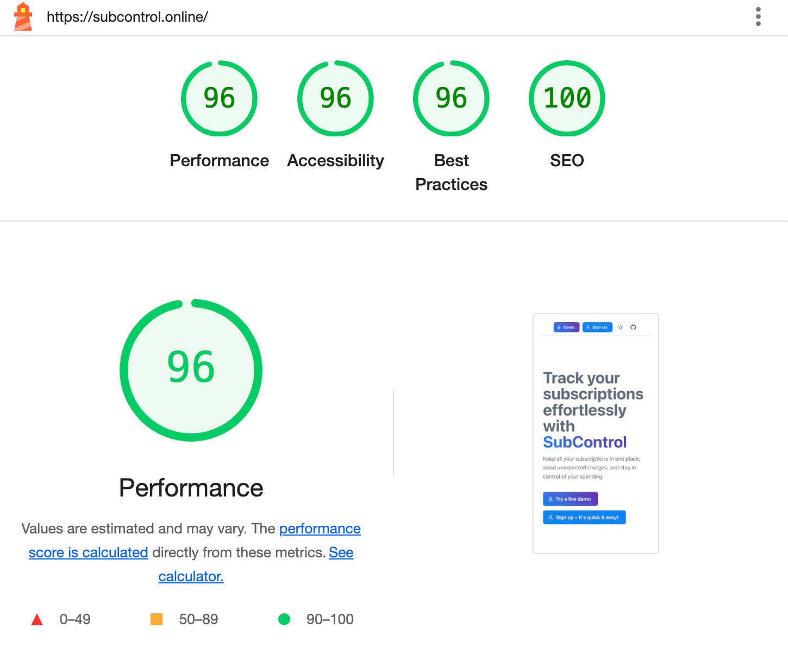
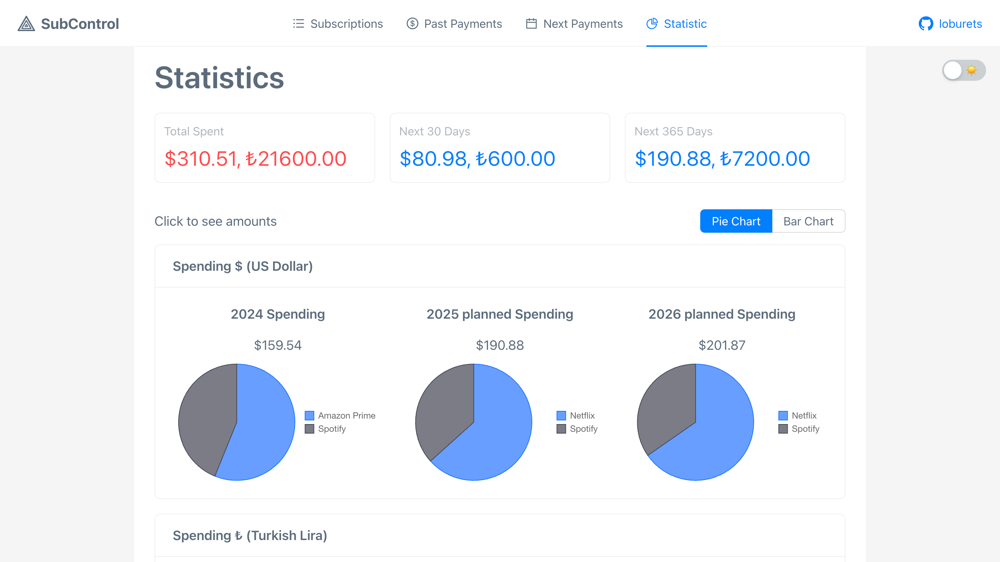
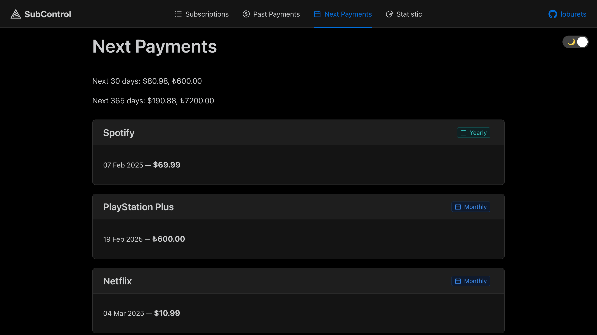
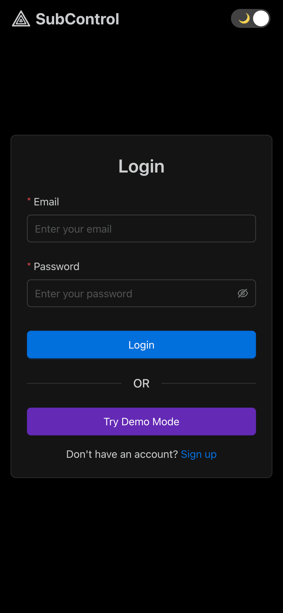
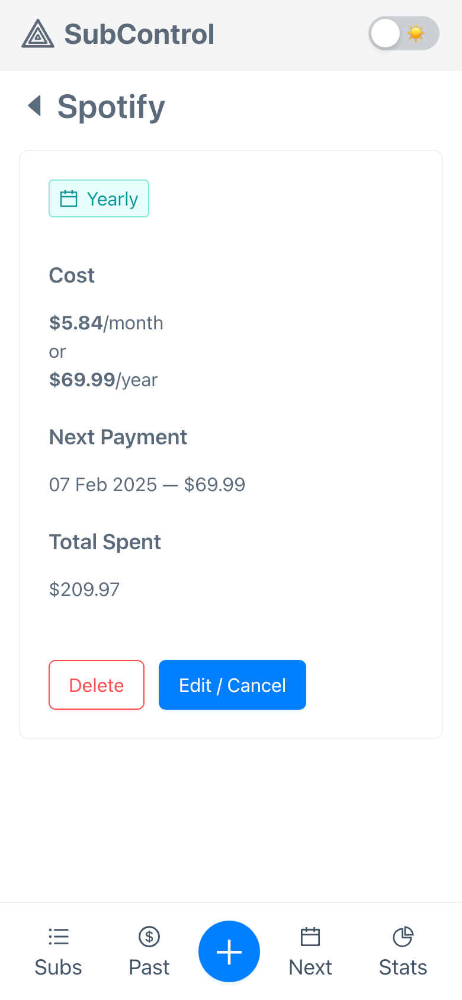
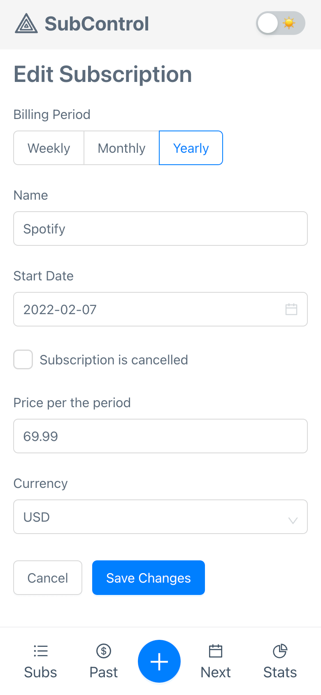

# SubControl – Subscription Tracking App

**🔗 Live Demo:** [https://subcontrol.online/](https://subcontrol.online/)

This project showcases my experience in modern frontend and backend technologies.

I hope it also shows some self-discipline to implement the best practices.

---

## 🛠️ Tech Stack

### **Backend**
- **NestJS** – Node.js framework.
- **TypeScript** – Strictly typed JavaScript.
- **PostgreSQL** – Relational database.
- **Prisma ORM** – Data scheme based: type-safe queries, migrations.
- **Docker** – Local database containerization.
- **BugSnag** – Error tracking.

### **Frontend**
- **React** – Frontend framework.
- **TypeScript** – Static typing for better developer experience.
- **Ant Design** – UI component library for a polished UI + form management.
- **Styled Components** – A way to organize styling.
- **TanStack React Query** – Efficient data fetching and caching.
- **Zustand** – Minimalistic state management.

### **Landing Page**
- **Next.js** – React framework with server-side rendering (SSR) and static site generation (SSG) for SEO-friendly, fast-loading pages, TypeScript included.
- **Mantine** – UI components optimized for SSR.

---

## ✅ Best Practices & Highlights

### **Common**
- 📏 **Code Formatting & Linting** – Ensured with [ESLint](.eslintrc.js) and [Prettier](.prettierrc).
- 📦 **Monorepo** – Great for small projects, structured using [npm workspaces](package.json).
- 🔢 **Node.js Version** – Defined in [.nvmrc](.nvmrc) for consistency.
- 📝 **TypeScript Strict Mode** – Enabled for better code quality.
- 📚 **CI/CD** – GitHub [workflows](.github/workflows) for linting, testing, and deployment.
- ⚙️ **Infrastructure as Code** – Simple example [by Render configuration](render.yaml).

### **Backend**
- 🚀 **Shared DTOs** – Consistent [request/response structures](packages/shared-dtos) across frontend & backend.
- 🏆 **The Testing Trophy** – Instead of the testing pyramid
- 🧪 **Integration Tests** – Covers controllers and can be run in parallel [(example)](apps/backend/tests/integration/subscriptions.controller.spec.ts).
- ⚡ **E2E Tests** – Written on Playwright [(example)](e2e/tests/main-flow-smoke.spec.ts).
- 🔄 **Database Migrations** – [DB Migration](apps/backend/prisma/migrations) for consistency across environments and proper CD.
- 🔒 **Secure API** – [Filters](apps/backend/src/main.ts) redundant fields in requests to prevent injections. [Filters](apps/backend/src/modules/transformers/transformers.service.ts) responses per DTOs to avoid exposing sensitive fields.
- 📌 **Enums Where Applicable** – Used for DB/Prisma data structures and in Request/Response types ([example](packages/shared-dtos/src/subscriptions/requests.dto.ts)).
- 📖 **Swagger API Docs** – Auto-generated with [TS decorators](apps/backend/src/modules/subscriptions/subscriptions.controller.ts). The documentation can [run requests on behalf of a test user](apps/backend/src/utils/swagger.ts). Available [here](https://backend-u7jt.onrender.com/api/).
- 💰 **Money Storage** – Stored as cents (integer format) for precision.
- 📜 **Logging** – Winston logger with environment-specific [transports](apps/backend/src/config/winston-logger.config.ts).
- 🔍 **Meaningful Logs** – No sensitive data in logs, only IDs.
- 🛠️ **BugSnag Integration** – Sentry alternative for error tracking.
- 🔄 **No Circular Dependencies** – Proper NestJS module structure prevents circular dependencies [(example)](apps/backend/src/modules/subscriptions/subscriptions.module.ts).
- 🧪 **Test Coverage** – [90%](apps/backend/jest.config.js) coverage with Jest.

### **Frontend**
- 🎛 **Custom Hooks** – Extracted reusable logic [(example)](apps/frontend/src/hooks/useDemo.ts).
- 🌙 **Dynamic Theming** – Switch between dark/light modes [automatically or manually](apps/frontend/src/store/themeSwitcher.store.ts).
- 🎨 **Consistent Styling** – Uses **design tokens** for unified theming [(example)](apps/frontend/src/components/Layout/Layout.styled.ts).
- 📱 **Fully Responsive** – Optimized for small mobile, tablet, and desktop. Form elements [are larger](apps/frontend/src/components/UI/FormElementsAdjuster.tsx) on mobile for easier interaction.
- 🧪 **React Testing Library** – Used for integration tests [(example)](apps/frontend/src/pages/Login.test.tsx).
- ⚡ **Performance Optimization** – **Memoization** for complex UI calculations to boost performance.
- ⏳ **Skeletons & Loading States** – Improve UX with skeleton loaders.
- 🧩 **Simplified Forms** – No need for a dedicated form manager; Ant Design Form is sufficient [(example)](apps/frontend/src/components/UI/SubscriptionForm.tsx).

### **Landing Page**
- 🎨 **Consistent Styling** – [Matches](apps/landing/src/app/layout.tsx) the main app for a unified experience.
- 🌙 **Shared Night Mode** – Theme state [is shared](apps/landing/src/components/ThemeSwitcher.tsx) with the main app.
- 🖼️ **Dynamic Screenshots** – Landing page [adapts screenshot themes](apps/landing/src/components/Image.tsx) to match the app.
- ⚡ **Hybrid Rendering** – Static content pre-rendered, dynamic content client-rendered.
- 📸 **Image Optimization** – Images are optimized for web.

---

## 🙌 Tests & Checks

Just sharing some of my satisfactory feelings when all checks passed.

### 🤤 All Checks Passed

### 🤤 Controller Test

### 🤤 End-to-End Test

### 🤤 Lighthouse scores (Landing)

---

## 📸 Screenshots

### Landing Page

| Light Mode | Dark Mode |
|------------|-----------|
|  |  |
|  |  |

### **Mobile Versions**

  
  &nbsp;&nbsp;&nbsp;&nbsp;&nbsp;&nbsp;&nbsp;&nbsp;&nbsp;
  

### **App Interface**

#### Main page

#### Stats

#### Payments

#### Mobile version

  
  &nbsp;&nbsp;&nbsp;
  
  &nbsp;&nbsp;&nbsp;
  

---

## 📌 Features

- ✍️ **Track Subscriptions** – Easily add and manage recurring services (e.g., Netflix, Spotify, Apple Music).
- 📅 **Payments Calendar** – Stay informed about your next charges.
- 📊 **Spending Charts** – Gain insights into your past and upcoming expenses.
- 🎨 **Dark & Light Mode** – Automatically adapts to your system theme.
- 📱 **Mobile-Friendly Design** – Fully responsive UI from 320px mobile to 4K screens.

---

## 😿 Trade-offs

As a small project, some features currently are not optimal for a real-world scenario and skipped:

- 📜 **Improved Logging** – Sensitive fields (e.g., name, email, phone number) should be filtered in logs automatically.
- 🔐 **Additional Features** – Social login, email notifications, password reset, and 2FA are potential enhancements.
- 🧩 **More Unit Tests** – Some complex methods still require better test coverage.
- 🛡 **Captcha Protection** – Each demo session creates records in the database, making it an easy target for spam and load creation. Captcha integration may be necessary with growth.
- 📦 **More Shared Logic** – Some components remain app-specific for simplicity [(e.g., ThemeSwitcher)](apps/landing/src/components/ThemeSwitcher.tsx), but more logic could be moved to shared packages.
- 📱 **PWA** – Progressive Web App features are not implemented yet.
- 📈 **Analytics** – No analytics tools are integrated yet.
- 🌐 **Accessibility and Internalisation** – No a11y or i18n features are implemented yet.
- 🔄 **Refresh Tokens** – Currently, the app uses a short-lived JWT token.
- 🔧 **Staging Environment** – Currently, the app is deployed directly to production for the main branch.
- 📦 **Deployment Optimisation** – Deployment is triggered for all 3 services (backend, frontend, landing) on each push to the main branch to make Render setup easier.
- 📈 **Lighthouse Scores** – Landing is fine, but the React app's Lighthouse scores can be improved further.
