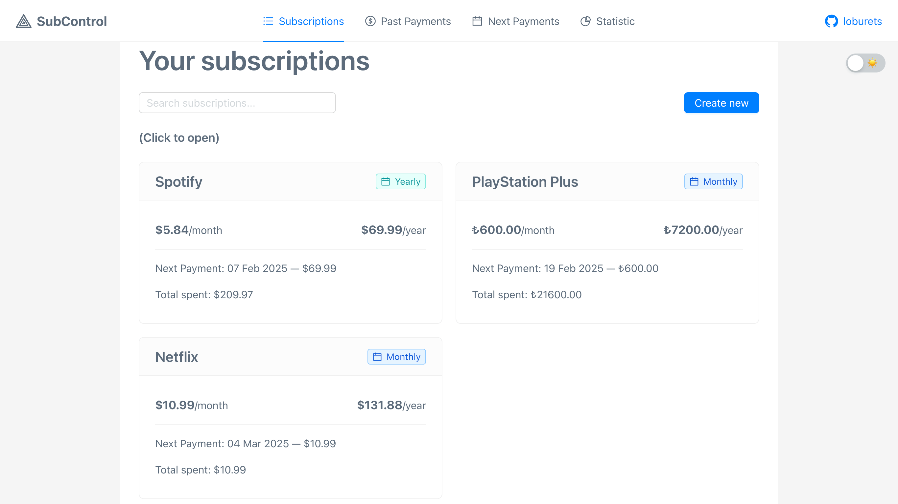
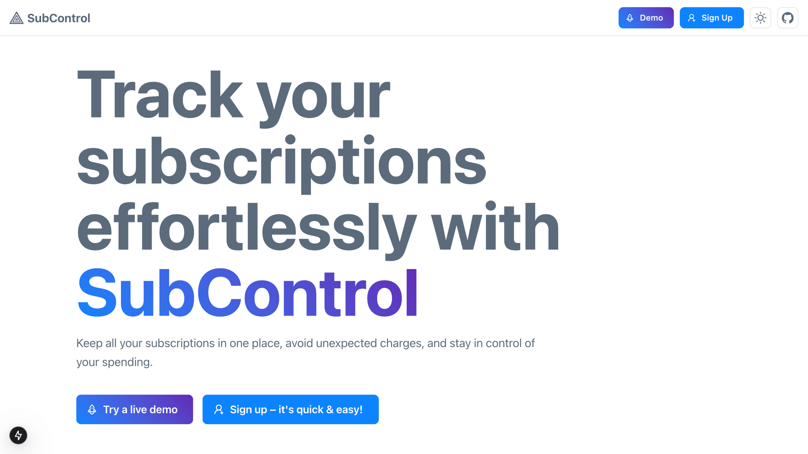
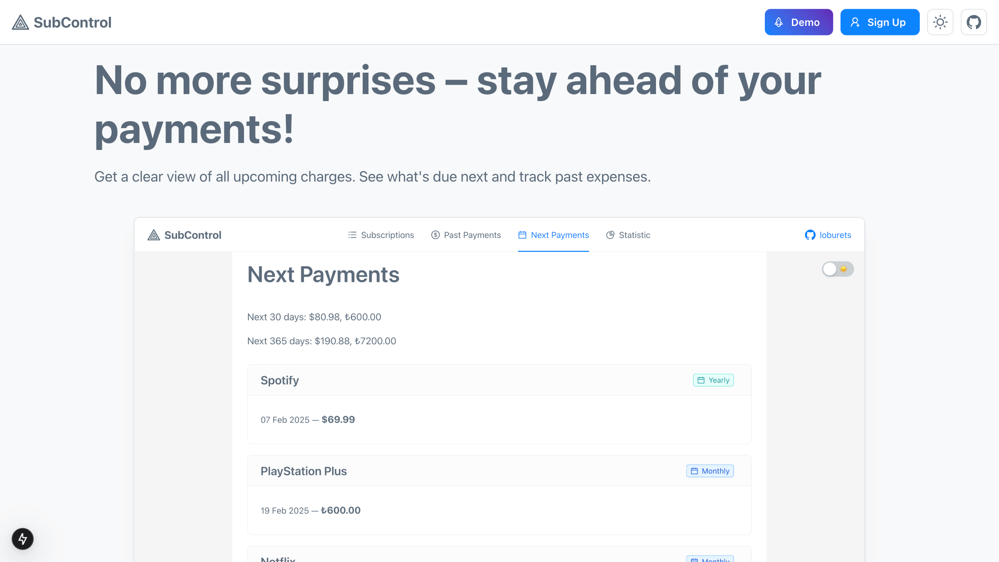
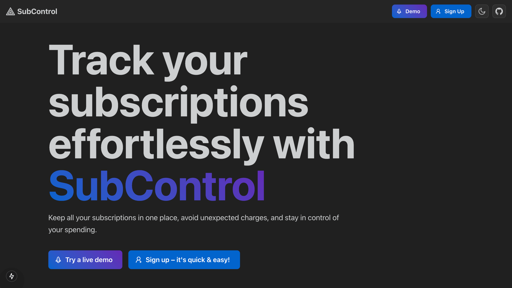
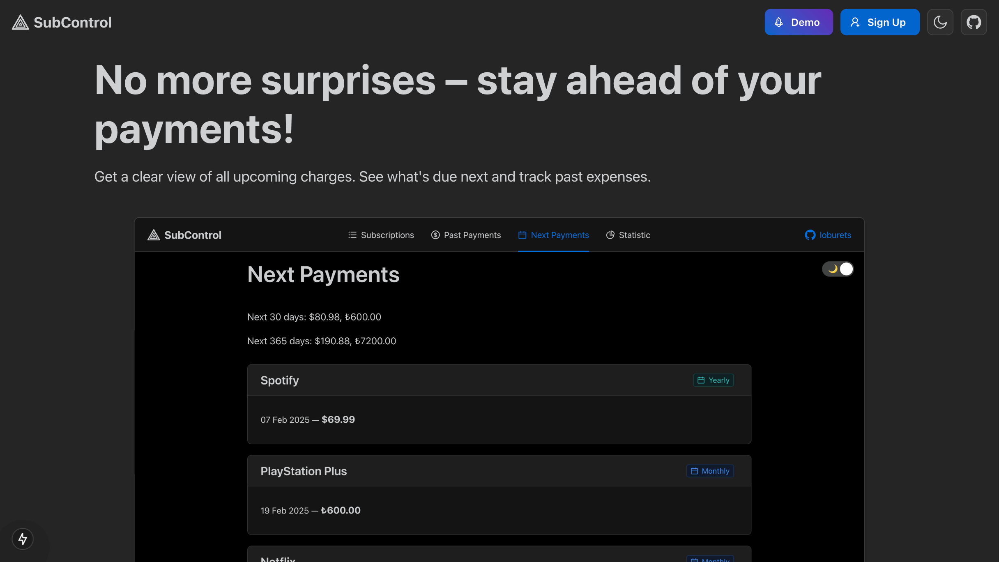
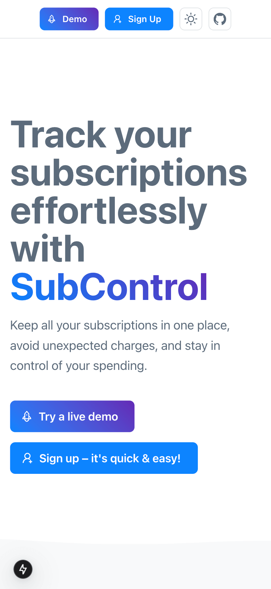
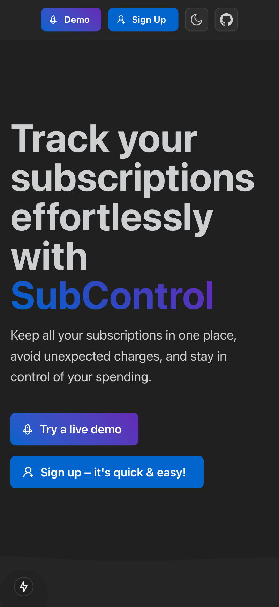

# SubControl

Frontend, backend and landing for the project

The main page example:

## Some good practices of this project:

- Same DTOs [are shared](packages/shared-dtos) between frontend and backend to have proper types
- [Eslint](.eslintrc.js) and [Prettier](.prettierrc)
- [Npm workspaces](package.json)
- [.nvmrc](.nvmrc) for Node version
- Docker to run DB locally
- More of the practices see below

## Backend

### Technologies

- TypeScript
- NestJS
- PostgreSQL
- Prisma ORM

### Some good practices:

- The Testing Trophy instead of the testing pyramid [(the tests are here)](apps/backend/tests)
- Integration tests made for controllers and they are ready to be run in parallel on the same DB
- [DB Migration](apps/backend/prisma/migrations)
- DTOs for requests with [filtering redundant fields to prevent injections](apps/backend/src/main.ts)
- DTOs for responses [to not expose sensitive fields](apps/backend/src/modules/transformers/transformers.service.ts)
- Enums for DB/Prisma and in Request/Responses types ([example](packages/shared-dtos/src/subscriptions/requests.dto.ts))
- Swagger documentation generated per [ts decorators](apps/backend/src/modules/subscriptions/subscriptions.controller.ts) and can [run requests on behalf of a test user](apps/backend/src/utils/swagger.ts)
- Money are stored as cents (integer value)
- Winston logger with [different transports](apps/backend/src/config/winston-logger.config.ts) for different environments
- No sensitive data in logs, only ids
- BugSnag integration (Sentry alternative for errors tracking)
- No circular dependencies due to [Nest Modules](apps/backend/src/modules/subscriptions/subscriptions.module.ts)

## Frontend

### Technologies

- TypeScript
- React
- Ant Design as components library
- Styled Components
- TanStack React Query

### Some good practices:

- React Hooks for reusable parts [(example)][apps/frontend/src/hooks/useDemo.ts]
- [Light/Dark theme with dynamic changing](apps/frontend/src/store/themeSwitcher.store.ts) and default value from the device
- [Tokens in styles](apps/frontend/src/components/Layout/Layout.styled.ts)
- Responsive design from 320px to 4k
- [Zustand](apps/frontend/src/store) for global states instead of context
- React testing library for integration tests ([example](apps/frontend/src/pages/Login.test.tsx))
- Skeletons for loading states
- Memoization for complex calculations like sorting during rendering
- No special Form manager as Ant Design Form is enough ([example](apps/frontend/src/components/UI/SubscriptionForm.tsx))
- Form elements [are bigger](apps/frontend/src/components/UI/FormElementsAdjuster.tsx) on mobile for easier touch

## Landing

### Technologies

- TypeScript
- React
- Next.js
- Mantine as components library (Ant Design is not good with SSR)

### Some good practices:

- Light/dark theme state [is shared](apps/landing/src/components/ThemeSwitcher.tsx) with main app
- The theme on screenshots of the app [is changed](apps/landing/src/components/Image.tsx) together with the theme on the Landing
- Dynamic components are rendered ond client-side  [(example)](apps/landing/src/components/ThemeSwitcher.tsx), but static content is pre-rendered
- The same [colors](apps/landing/src/app/layout.tsx) and fonts as in the main app

## How it looks

I'm not sure for how long the app will be available, so I've made screenshots of it

### The landing page

### Or the dark version

### Mobile versions are also included

  
  

